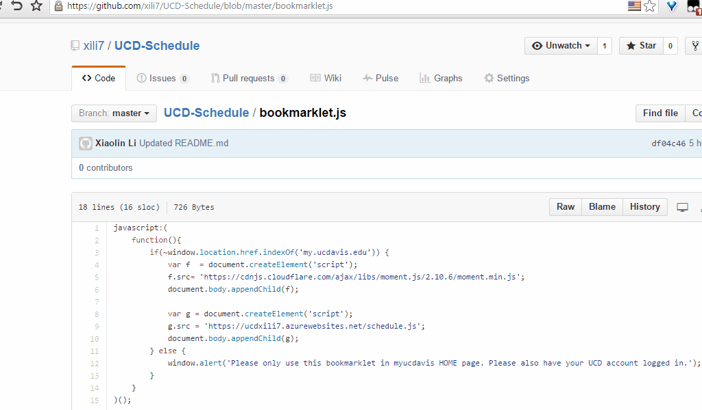

# UCD-Schedule
A bookmarklet that helps UCD students add their class schedule to Google Calendar.

##Instructions

1. Open [bookmarklet.js](bookmarklet.js) and copy the whole file.
2. Make a new bookmark in your browser and paste what you copied as the URL.  
  The name of the bookmark can be anything.
  IMPORTANT: The URL should start with **javascript:**  
  If you don't see it at the beginning of the URL you pasted, add it back.
3. Go to [my.ucdavis.edu](my.ucdavis.edu), and login your UCD account.
4. Click the bookmark you created.
5. Follow the instructions at the mySchedule tile.  

**For now, you can only add your Winter 2015 schedule to Google Calendar.**

You can also skip step 2 and step 4 and just paste the code into the browser address bar and press enter.

This project was inspired by [this webapp](http://ucdgcal.appspot.com/). 
I used it for 2 quarters and liked it a lot.  However, the author stopped updating the project since the quarter of Spring 2015.

Differences between this project and the webapp above  
1. The user have to search his/her classes manually in the webapp.  
2. The bookmarklet works by parsing the user's class schedule in MyUCDavis, so the user doesn't have to manually search the class to add.
However, the user cannot add classes that he/she didn't registered/waitlisted for.  
3. The user can change the color of the events in the webapp (Will be implemented in this project soon).  
